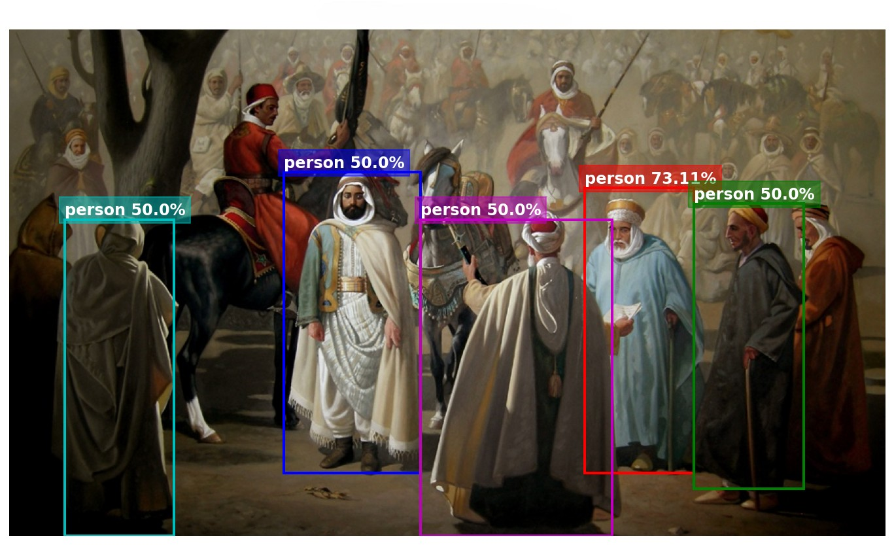
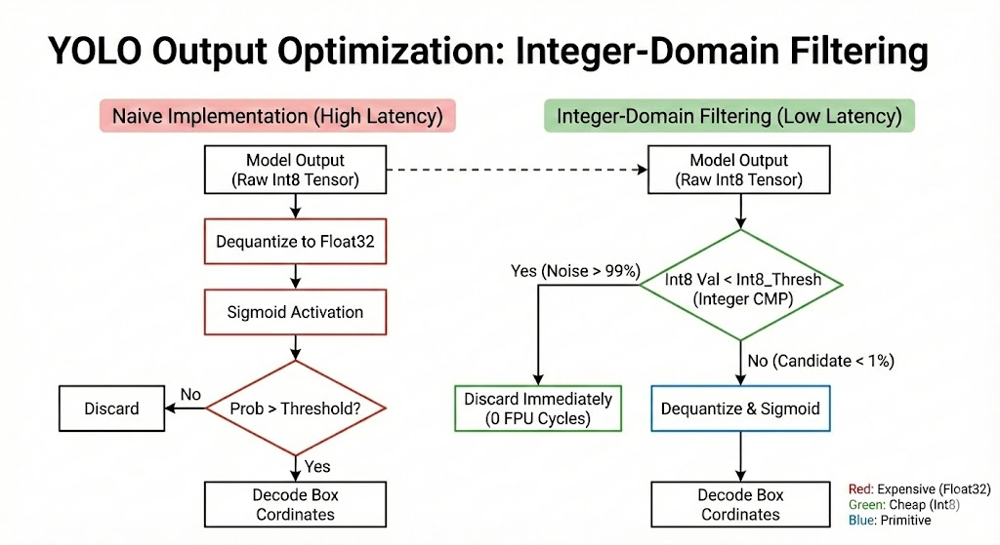

author: Billal Boumedine 
date: January 2026

# World’s First YOLO26n on ESP32-P4: Adapting Training Pipelines for QAT and Graph Optimization to Achieve 36.5% mAP at 512px Resolution with 1.7s Latency

> "Optimization is not just about making things faster; it is about restructuring the problem so that the hardware solves it naturally."




## Abstract

This project documents the first successful deployment of the **YOLO26n** architecture on the **ESP32-P4** microcontroller, setting a new benchmark with **1.7s latency** at **512x512 resolution** and **36.5% mAP (coco dataset)**. Standard Post-Training Quantization (PTQ) workflows often destroy the accuracy of modern detection models on low-precision hardware. To solve this, I built a custom **Quantization-Aware Training (QAT) pipeline** that connects the `esp-ppq` backend directly to `ultralytics` loss functions. This allowed me to fine-tune the 8-bit weights against the strict One-to-One matching signal of YOLO26, preserving accuracy even with the simplified regression head.

I designed the optimization strategy specifically for the ESP32-P4’s **RISC-V PIE (SIMD) instruction set extension**. By performing a **"Split-Head" Graph Surgery**, I decoupled the computational graph: the heavy convolution layers run on the hardware-accelerated SIMD extensions, while the complex non-linear decoding which is inefficient for vector processing moves to a custom C++ **`Yolo26Processor`**. This processor uses **LUT-based lossless input quantization** and **integer-domain thresholding** to bypass floating-point normalization and skip over 99% of unnecessary Sigmoid activations. The result proves that you can run high-fidelity object detection on edge silicon if you are willing to co-design the software stack around the hardware’s actual limits.

## Performance Benchmark: 1.77s Inference at 36.5% mAP

Before detailing the engineering methodology, I present the final deployment results on the ESP32-P4. The goal was not just to run the model, but to outperform the current state-of-the-art (SOTA) baseline specifically the official YOLOv11n implementation in `esp-dl` in terms of efficiency at comparable accuracy.

### Comparative Results (ESP32-P4)

| Model Architecture | Configuration | Resolution | mAP (COCO) | Latency | Benchmark | Status |
| :--- | :--- | :--- | :--- | :--- | :--- | :--- |
| **YOLO26n (Optimized)** | **Int8 QAT** | **512x512** | **36.5%** | **1.77s** | **[link](#)** | **✅ Target** |
| YOLO26n (High-Res) | Int8 QAT | 640x640 | 38.5% | 3.00s | [link](#) | |
| YOLOv11n (Baseline) | Official ESP-DL QAT | 640x640 | 36.0% | 2.75s | [link](https://github.com/espressif/esp-dl/tree/master/models/coco_detect) | |

### Analysis: Why 512px is the Winner

While YOLOv11n appears faster at 640x640 (2.75s vs 3.00s), a direct resolution comparison is misleading. The true engineering metric is **latency at equivalent accuracy**.

To achieve a target accuracy of ~36% mAP, the standard YOLOv11n requires a resolution of 640x640, forcing a computation cost of 2.75s per frame. In contrast, my optimized YOLO26n pipeline achieves a higher accuracy of **36.5% mAP** at a reduced resolution of **512x512**, dropping the inference time to just **1.77s**.

This resolution shift, enabled by the superior feature extraction of the v26 architecture and my QAT pipeline, results in a net performance gain of **35% faster inference (1.77s vs 2.75s)** while maintaining a slight accuracy advantage (+0.5% mAP).

> **Note on Real-Time Performance & Optimization Potential:**
>
> While **1.77s** is not "real-time" (typically <30ms), this benchmark deliberately stresses the hardware to establish a fair comparison.
> 1.  **Resolution:** Standard YOLO models are trained at high resolutions (512/640px). Matching these dimensions is necessary to validate the architectural efficiency against official baselines, even though many edge applications run successfully at much lower resolutions (e.g., 224px or 320px).
> 2.  **Class Count:** The COCO dataset forces the model to learn **80 distinct object classes**, consuming significant capacity. In real-world edge scenarios, we typically only need to detect a specific subset (e.g., just "person" or "defect"), meaning that with the same model size we can get more accuracy.
>
> Reducing the class count and input resolution can drastically improve both speed and accuracy, though likely still short of 30FPS on this specific hardware without more smart optimizations. There are still many factors to optimize to achieve real-time performance, and balancing "sufficient" accuracy with maximum throughput remains a key objective for future projects.

## The Deployment Challenge: Why ESP32-P4 is Different

To understand the magnitude of this engineering effort, it is helpful to contrast it with the standard "easy mode" of Edge AI. If I were deploying this same model to a Linux-based system with a [Google Coral TPU](https://developers.google.com/coral), the entire process would typically look like this:

 ```python
from ultralytics import YOLO

# Load the YOLO26 model
model = YOLO("yolo26n.pt")

# Export the model to TFLite Edge TPU format
model.export(format="edgetpu")  # creates 'yolo26n_full_integer_quant_edgetpu.tflite'

# Load the exported TFLite Edge TPU model
edgetpu_model = YOLO("yolo26n_full_integer_quant_edgetpu.tflite")

# Run inference
results = edgetpu_model("https://ultralytics.com/images/bus.jpg")
 ```

With just a single line of code, the model is quantized, compiled, and ready to run. Why does this "magic" not exist for microcontrollers?

The answer lies in the fundamental difference between a specialized AI accelerator and a low-cost microcontroller. The [ESP32-P4](https://www.espressif.com/en/products/socs/esp32-p4) is not a Linux computer with a dedicated NPU; it is a highly efficient MCU designed for cost-sensitive and energy-constrained applications. While it features the powerful [RISC-V "PIE" (Processor Instruction Extensions)](https://developer.espressif.com/blog/2024/12/pie-introduction/), this is a SIMD (Single Instruction, Multiple Data) instruction set extension, not a black-box neural accelerator.

To unlock the P4's performance, operations must be executed in **Int8 precision**. However, modern object detection models like YOLO26n are trained in **Float32**. Bridging this gap is not a simple matter of rounding numbers.

1.  **Quantization Sensitivity:** Naive conversion of weights from Float32 to Int8 introduces "quantization noise." For sensitive architectures like YOLO26n which uses a simplified regression head (`RegMax=1`) this noise often destroys the model's ability to localize objects, causing accuracy to collapse.
2.  **No "Magic Line":** Unlike the mature TFLite ecosystem, there is no single function in the MCU toolchain that can automatically analyze, calibrate, and fine-tune a custom architecture like YOLO26n without degradation.
3.  **Hardware-Specific Constraints:** On a TPU, one rarely worries about efficient memory alignment or specific operator support. On the ESP32-P4, every layer must be scrutinized to ensure it maps to a hardware-accelerated PIE instruction. If a single layer falls back to standard CPU execution, the latency penalty is severe.

Therefore, deploying to the ESP32-P4 requires abandoning the "one-click" export mentality and building a custom pipeline that handles these constraints explicitly.

## The Solution: A Custom QAT Pipeline

To bridge the gap between the raw PyTorch model and the ESP32-P4's silicon, I established a rigorous deployment pipeline. This section outlines the high-level workflow, with deep dives into each specific engineering challenge to follow in subsequent parts.

### 1. The Starting Point: YOLO26n
I began with the official pre-trained YOLO26n model, optimized for the COCO dataset. This architecture was chosen for its excellent balance of parameter efficiency and detection performance.

**Official Performance Metrics (Float32)**:

| Model | Size (px) | mAP val (50-95) | Speed CPU ONNX (ms) | Params (M) | FLOPs (B) |
| :--- | :--- | :--- | :--- | :--- | :--- |
| **YOLO26n** | 640 | 40.9% | 38.9 | 2.4 | 5.4 |

### 2. The Bridge: `esp-ppq`
The core of this project relies on [esp-ppq](https://github.com/espressif/esp-ppq), Espressif’s specialized fork of the [OpenPPL PPQ](https://github.com/OpenPPL/ppq) library. I chose this tool specifically because it allows for granular control over the quantization process, enabling operation-level optimization that generic tools (like TFLite converters) cannot provide.

### 3. The Workflow
The transformation from a PyTorch checkpoint to a hardware-ready binary involves three critical stages:

1.  **Graph Capture & Quantization:**
    The first step involves wrapping the standard model operations into a PPQ graph. This graph simulates the ESP32-P4's hardware constraints, converting the Float32 weights to Int8. Typically, this initial "Post-Training Quantization" (PTQ) results in a significant drop in accuracy for compact models like YOLO26n.

2.  **Quantization-Aware Training (QAT):**
    To recover the lost accuracy, I leveraged a unique feature of the PPQ graph: **gradient flow support**. By injecting "fake quantization" nodes which simulate the rounding errors of Int8 math I can run a training loop on the quantized graph itself. This allows the model to adjust its weights specifically to minimize the error caused by quantization, rather than just minimizing the detection loss.

3.  **Hardware Export (.espdl):**
    Once the Int8 model recovers its accuracy, the final step is compiling the graph into the `.espdl` format. This proprietary binary format is optimized for the ESP-DL library, ensuring that every layer maps correctly to the P4's SIMD instructions.


## Step 1: Intelligent ONNX Export & Graph Cleaning

The `esp-ppq` quantization toolchain requires an ONNX model as its input. This is because effective quantization relies on collecting statistics from the model's weights and feature maps to determine optimal scale factors. Unlike PyTorch, which utilizes a dynamic computational graph, ONNX provides a static graph representation that allows `esp-ppq` to parse the structure, track operations, and inject the necessary quantization nodes reliably.

To achieve this, the first step is converting the dynamic PyTorch model into this static format. In a standard "easy mode" workflow, a developer would typically attempt the export with a single, convenient block of code:

```python
from ultralytics import YOLO

# Load your model (pretrained or custom)
model = YOLO("yolo26n.pt") 

# Export to ONNX (The "Naive" Approach)
success = model.export(format="onnx")
```

While this naive approach produces a valid ONNX file for PC-based inference, it is insufficient and often detrimental for hardware-aware quantization on the ESP32-P4. Exporting the model "as-is" introduces two critical problems that I had to solve via custom graph surgery.

### Challenge 1: The "Decoded" Detection Head
In a standard YOLO export, the `Detect` head includes post-processing logic: it decodes bounding box coordinates (multiplying by strides, applying anchor points) and concatenates them with class scores. While convenient for high-level APIs, this logic is toxic for MCU quantization:

1.  **QAT Compatibility (Crucial):** For Quantization-Aware Training to work, we need to calculate the loss during the fine-tuning loop. The standard Ultralytics loss functions are designed to accept **raw grid predictions** to compute gradients and update weights. If the model outputs fully decoded boxes, we break the gradient flow, making it impossible to fine-tune the model against the quantization error.
2.  **Quantization Complexity:** Operations like `Slice`, `Concat`, and `Mul` in the decoding block are highly sensitive to quantization noise.
3.  **Inefficiency:** It is far more efficient to handle this decoding in C++ on the CPU using standard integer math than to force it through the quantized neural network graph.

**The Solution: Exporting Raw Feature Maps**
Instead of the full post-processed output, I modified the export logic to abort the `Detect.forward` method early. I configured the model to output the raw tensors from the **One-to-One (one2one)** branch the specific branch trained with Hungarian Matching for NMS-free inference.

This results in exactly **6 output tensors** (3 Scales × 2 Data Types) that represent the raw grid predictions. These are the "clean" signals the quantization tool needs to analyze.

| Output Name | Stride | Grid Size (512px Input) | Channels | Description |
| :--- | :--- | :--- | :--- | :--- |
| `one2one_p3` | 8 | 64x64 | 84 | Small Objects (4 Box + 80 Class) |
| `one2one_p4` | 16 | 32x32 | 84 | Medium Objects (4 Box + 80 Class) |
| `one2one_p5` | 32 | 16x16 | 84 | Large Objects (4 Box + 80 Class) |

*Note: The 84 channels consist of 4 Box Regression values (dx, dy, dw, dh) and 80 COCO Class Scores.*

 The standard ONNX export includes a massive Decoding Block filled with operations that break QAT gradient flow and degrade quantization accuracy. (Right) The result of my graph surgery: the model now terminates cleanly at the raw One-to-One regression and classification heads, preserving the exact signals needed for both efficient training and hardware acceleration.")

### Challenge 2: Dynamic Shape Arithmetic in Attention Layers
The second issue lies in the YOLOv26 Attention modules (e.g., C2PSA). The standard implementation calculates tensor dimensions at runtime using operations like `x.shape[2] * x.shape[3]`.
* **The Problem:** When exported, this generates a complex subgraph of `Shape -> Gather -> Mul` nodes just to calculate dimensions that are technically constant for a fixed input size. This "dynamic noise" confuses the esp-ppq compiler and complicates the graph optimization for the PIE instruction set.
* **The Fix (`ESP_Attention`):** I implemented a "monkey patch" that replaces the dynamic shape calculation with a static `x.view(Batch, Heads, Dim, -1)` operation.

By forcing the exporter to use `dynamic=False` combined with this patch, the ONNX exporter "bakes in" the exact constant dimensions (e.g., `Reshape to 64x64`). This produces a streamlined, static graph that the ESP32-P4 compiler can ingest without errors, ensuring that every cycle is spent on convolution, not shape arithmetic.

 The standard export generates a complex subgraph of dynamic shape arithmetic (Shape -> Gather -> Mul) that confuses the MCU compiler. (Right) The patched ESP_Attention module forces a single, static Reshape node, critical for efficient execution on the ESP32-P4.")

## Step 2: Selective Quantization & The "Teacher-Student" Graph

With the clean ONNX graph from Step 1 now explicitly exposing both the **Main (One-to-One)** and **Auxiliary (One-to-Many)** branches, we move to the quantization strategy.

A standard quantization tool would blindly convert every operation in this graph to Int8. However, because we deliberately preserved the Auxiliary branch for training purposes, blindly quantizing it would be a mistake. The Auxiliary branch serves as a "teacher" during the fine-tuning process; if we quantize it, we introduce noise into the very signal supposed to guide the model.

### The "Hybrid Precision" Strategy

To solve this, I implemented a **topology-aware quantization routine** within the `esp-ppq` workflow. Instead of a global Int8 setting, I enforced a strict hybrid policy based on the graph's structure:

1.  **Main Branch (One-to-One):**
    These layers are marked for **Int8 Quantization**. This is the path that will actually run on the ESP32-P4, so the model must learn to adapt to the lower precision here.

2.  **Auxiliary Branch (One-to-Many):**
    I traced the graph backwards from the auxiliary outputs to identify operators exclusive to this branch. These are forced to remain in **Float32**. This ensures the "teacher" provides a high-fidelity gradient signal during training.

3.  **Shared Backbone:**
    Since the backbone feeds the Main branch, it must be **Quantized**.

This setup creates a perfect QAT environment: the shared weights are fine-tuned to survive Int8 quantization, guided by a high-precision auxiliary loss that remains unaffected by the hardware constraints.

> **Note: The Engineering Logic Behind the "Auxiliary" Branch**
>
> To understand why we treat the two heads differently, we must look at the "Dual-Head" architecture introduced in YOLOv10 and refined in YOLO26.
>
> * **One-to-One Head (The "Student"):** This is our deployment target. It uses Hungarian Matching to predict exactly *one* box per object, eliminating the need for NMS inference. However, this creates a "sparse" gradient signal that is difficult to learn from scratch.
> * **One-to-Many Head (The "Teacher"):** This branch matches a single object to *multiple* positive predictions, generating a "dense" and rich gradient signal for feature learning.
>
> **The Strategy:** In our QAT pipeline, the Auxiliary branch acts as a **high-precision teacher**. By forcing it to remain in **Float32**, we ensure the optimization gradients remain pure. Meanwhile, the Main branch is quantized to **Int8**, forcing it to learn how to produce accurate, single-box predictions *despite* the hardware-induced precision loss. This "Teacher-Student" dynamic is the secret to recovering accuracy in low-bit deployments.

 The One-to-Many auxiliary head is kept in Float32 to provide high-fidelity gradients (the Teacher). (Right) The One-to-One deployment head is quantized to Int8 (the Student), forcing it to learn robust predictions under hardware constraints.")


## Step 3: Post-Training Quantization (PTQ) & Statistical Calibration

With the "Hybrid" graph defined keeping the teacher in Float32 and the student in Int8 we arrive at the critical baseline phase: **Calibration** (or PTQ).

You cannot simply "switch" a neural network to 8-bit integers and expect it to work. The model needs to establish a statistical baseline. It must determine: *"If my floating point activation is 5.67, what integer does that correspond to?"* To answer this, we must run a rigorous statistical analysis using real data.

### The "Sound Check" Approach
I treat calibration like a sound check before a concert. We do not need the full training dataset; we simply need a representative subset (the `cali_loader`) to set the levels scales and offsets correctly so the signal doesn't clip or vanish.

However, blind statistics are not enough. We must ensure we are measuring the data as the *hardware* will see it, not how PyTorch sees it. To do this, I implemented a rigid optimization pipeline that structures the graph before a single value is measured.

```python
# Calibration Pipeline: Simulate Hardware Reality
# This sequence forces the software graph to mimic ESP32-P4 behavior
print("Running Calibration Pipeline...")

pipeline = PFL.Pipeline([
    QuantizeSimplifyPass(),
    
    # 1. Fuse layers (Conv+Bn+Relu) to match hardware execution
    # This prevents calibrating intermediate values that won't exist on the chip
    QuantizeFusionPass(activation_type=quantizer.activation_fusion_types),
    
    # 2. Fix the quantization range for specific layers
    ParameterQuantizePass(),
    
    # 3. The "Sound Check": Collect statistics (Min/Max/Entropy) from real data
    RuntimeCalibrationPass(method=QATConfig.QUANT_CALIB_METHOD),
    
    # 4. Handle passive parameters
    PassiveParameterQuantizePass(clip_visiblity=QuantizationVisibility.EXPORT_WHEN_ACTIVE),
    
    # 5. Enforce topological constraints (Critical for ESP32-P4)
    QuantAlignmentPass(elementwise_alignment=QATConfig.QUANT_ALIGNMENT),
])

# Execute the optimization
pipeline.optimize(
    calib_steps=QATConfig.CALIB_STEPS,
    collate_fn=(lambda x: x.type(torch.float).to(QATConfig.DEVICE)),
    graph=graph,
    dataloader=cali_loader, # A subset of real images
    executor=executor,
)
```

### 1. Simulating Hardware Reality: Fusion
The ESP32-P4 does not execute a Convolution, then a Batch Normalization, and then a ReLU as three separate steps. To maximize throughput, the hardware compiler "fuses" these into a single atomic operation.

If we calibrated these layers individually, our statistics would be wrong. The `QuantizeFusionPass` merges these operations within the software graph first. This ensures we are calibrating the **exact signal** that will be processed by the MCU, preventing mismatch errors later.

### 2. The Statistical Observer
Once fused, the `RuntimeCalibrationPass` executes the analysis. It feeds batches of real images from the `cali_loader` through the network, placing "observers" at every junction to record the dynamic range of the activations. We aren't training weights here; we are purely listening to the data to calculate the initial `scale` and `zero_point`.

> **Crucial Note on Alignment:**
>
> The final step, `QuantAlignmentPass`, is critical for performance. The ESP32-P4, like many hardware accelerators, enforces **strict topological rules**. Operations like **Concatenation**, **Elementwise Add**, and **Pooling** often require their input and output tensors to share the exact same quantization parameters (Scale and Zero-Point).
>
> If these parameters mismatch, the CPU must perform costly, on-the-fly requantization during inference, destroying latency. This pass scans the graph and "locks" related tensors together (e.g., forcing all inputs of a Concat to match its output scale), ensuring the model is topologically valid for zero-overhead execution.

## Step 4: Recovering Accuracy with Quantization-Aware Training (QAT)

Calibration (PTQ) provides a solid baseline, but for a compact model like YOLO26n (only 2.4M parameters), the precision loss from Int8 conversion often degrades detection performance below acceptable limits. To fix this, we need the model to "learn" how to operate within these constraints.

This brings us to **Quantization-Aware Training (QAT)**. In this step, we fine-tune the model *through* the quantization simulation. The gradients calculated during backpropagation adjust the weights specifically to minimize the error caused by the Int8 rounding we introduced in the previous steps.

### The Training Loop

The training loop looks deceptively similar to a standard PyTorch loop, but the components doing the heavy lifting are specialized for the `esp-ppq` graph.

```python
print("Starting QAT Training...")

# Initialize the QAT Trainer
# This wrapper handles the forward pass through the FakeQuant nodes
# and ensures gradients flow correctly to the underlying weights.
trainer = QATTrainer(graph=graph, model_meta=model_meta, device=QATConfig.DEVICE)

if not os.path.exists(QATConfig.ESPDL_OUTPUT_DIR):
    os.makedirs(QATConfig.ESPDL_OUTPUT_DIR)

best_mAP = 0
for epoch in range(QATConfig.EPOCHS):
    print(f"\n--- Epoch {epoch+1}/{QATConfig.EPOCHS} ---")
    
    # Train Epoch: Fine-tune weights against quantization noise
    trainer.epoch(train_loader)
    
    # Validate: Calculate real mAP on the quantized graph
    current_mAP = trainer.eval()
    print(f"Epoch: {epoch+1}, mAP50-95: {current_mAP:.3f}")
    
    # Save the Best Model
    if current_mAP > best_mAP:
        best_mAP = current_mAP
        print(f"New best mAP! Saving to {QATConfig.ESPDL_OUTPUT_DIR}...")
        
        # Export the native graph (.espdl/.json) for the ESP32-P4
        trainer.save_graph(os.path.join(QATConfig.ESPDL_OUTPUT_DIR, "Best_yolo26n.native"))
```

### The Challenge: Validating Raw Signals
Because we stripped the `Detect` head in Step 1, standard YOLO validators which expect decoded boxes will fail.

To solve this, the `QuantizedModelValidator` acts as a hardware simulator. It runs the neural network layers using simulated **Int8 PIE instructions**, while offloading the final decoding logic (strides and anchors) to standard CPU arithmetic. This validates our "Hybrid" architecture, proving the model maintains accuracy even when execution is split between the ESP32-P4's AI extensions and its general-purpose core.

 leaves the model with degraded performance (0.319 mAP), the Quantization-Aware Training (QAT) pipeline effectively recovers precision. By fine-tuning the model against simulated quantization noise, we achieved a 14.4% accuracy boost, restoring detection capabilities to near-floating-point levels (0.365 mAP) for the ESP32-P4.")


## Step 5: Final Graph Surgery (Optimization)

We now have a calibrated, fine-tuned Int8 model (`Best_yolo26n.native`) that recovers the accuracy lost during quantization. However, simply exporting this graph "as-is" would leave performance on the table.

The final challenge is **Memory Layout Optimization**. The model currently outputs a concatenated tensor of **84 channels** (4 Box + 80 Class) per grid cell. While this is tidy for Python, it is inefficient for the ESP32-P4's C++ post-processing.

### The "Zero-Copy" Optimization
If we deploy the concatenated output, the CPU must burn cycles slicing the memory buffer back apart to separate the bounding box coordinates from the class probabilities.

To solve this, I wrote a custom **Graph Surgery Script** that modifies the network topology one last time.
1.  **Amputate the Concat:** We locate the final `Concat` operation that joins the Box and Class heads.
2.  **Expose Raw Pointers:** We delete the `Concat` node and promote its *inputs* (the raw Box and Class tensors) to be the new graph outputs.
3.  **Result:** The cpu writes the Box and Class data into separate, contiguous memory buffers. The C++ decoder can then read them directly ("Zero-Copy") without any intermediate processing.

### The Graph Surgery Logic
This script loads the QAT result, removes the training-only auxiliary heads, and executes the split.

```python
# Load the Best QAT Model
graph = load_native_graph(import_file="Best_yolo26n.native")

# 1. Strategy: Find and Destroy Concat Nodes
targets = ["one2one_p3", "one2one_p4", "one2one_p5"]

for target_name in targets:
    # Identify the 'Concat' op feeding the output
    producer = graph.variables[target_name].source_op 
    
    if producer.type == "Concat":
        print(f"Splitting {target_name} at Source Concat...")
        
        # Identify inputs (Box=4 channels, Class=80 channels)
        box_var = next(v for v in producer.inputs if 4 in v.shape)
        cls_var = next(v for v in producer.inputs if 80 in v.shape)
        
        # Rename them for clarity
        box_var._name = f"{target_name}_box"
        cls_var._name = f"{target_name}_cls"
        
        # Register them as NEW Graph Outputs
        graph.outputs.pop(target_name)  # Remove old combined output
        graph.outputs[box_var.name] = box_var
        graph.outputs[cls_var.name] = cls_var
        
        # Delete the Concat Op to break the link
        graph.remove_operation(producer)
```

### Why "Safe Pruning" is Critical
After deleting the `Concat` node, the graph is left with "dangling" references. A standard export might fail or include dead code. The script includes a **Robust Pruning Routine** (omitted for brevity) that recursively traces the graph, identifying and removing any operations that no longer connect to the new outputs. This ensures the final structure is as compact as possible, saving precious kilobytes in the ESP32-P4's memory.

 The default export produces a single concatenated tensor (84 channels), forcing the CPU to waste cycles slicing memory to separate coordinates from classes. (Right) The modified graph deletes the Concat node, exposing the raw Box and Class tensors as separate outputs. This allows the C++ application to read directly from contiguous memory buffers without any copy or split operations.")

## Step 6: Exporting the Artifact

With the surgery complete and the "Concat" nodes successfully amputated, our graph is topologically perfect for the ESP32-P4. The final step is to serialize this structure into the native format required by the **ESP-DL** library.

### The `.espdl` Format
Unlike ONNX, which is a generic exchange format, the `.espdl` file is a highly optimized binary structure tailored for Espressif's hardware constraints. It explicitly contains:
1.  **Hardware-Specific Layer Definitions:** A graph structure optimized for the ESP32-P4's execution engine, replacing generic operations with hardware-compliant equivalents.
2.  **The Weights:** Compressed and aligned Int8 parameters ready for direct loading.
3.  **Quantization Exponents:** The scale factors (shifts) that allow the CPU to interpret the Int8 values back into real-world numbers.
4.  **Activation LUTs:** Look-Up Tables for non-linear functions (like Sigmoid or Silu), pre-calculated to save runtime cycles.

```python
# Final Export
# This generates the binary that will be flashed to the device
print(f"Exporting Final Model to {inference_export_path}...")

exporter = PFL.Exporter(platform=QATConfig.TARGET_PLATFORM)
exporter.export(inference_export_path, graph=graph)

print("Success: 'yolo26n_inference.espdl' generated.")
```

### The Handover
This command produces the final **`yolo26n_inference.espdl`**. This is the artifact we will flash to the ESP32-P4's storage partition.

Because we manually enforced the output order in the previous step (Box first, then Class), our C++ application can safely map these pointers blindly, knowing that `Output[0]` will always be the Small Object Bounding Boxes and `Output[1]` will be the Small Object Class Scores. We have effectively "hard-coded" the interface between the neural network and the application logic.

> **Pro Tip: Visualizing the Native Graph**
>
> A huge thank you to [Sun Xiang yu](https://github.com/sun-xiangyu) for adding `.espdl` support to **Netron**, the standard viewer for deep learning models. This allows us to inspect the final binary just like an ONNX file, verifying that our quantization parameters and layer fusions are correct before deployment.
>
> While the [PR to the official Netron repo](https://github.com/lutzroeder/netron/pull/1338) is pending, you can install the custom version to view your exported models:
>
> ```bash
> # Install Netron with .espdl support
> pip install  git+https://github.com/sun-xiangyu/netron
> ```
>
> Then, launch the viewer using Python:
> ```python
> import netron
> netron.start("yolo26n_inference.espdl")
> ```


 Visualizing the exported binary using the custom Netron viewer. The generic ONNX operations have been replaced by hardware-specific primitives for the ESP32-P4. Note the Swish Activation (originally $x \cdot \sigma(x)$) has been fused into a high-performance Look-Up Table (LUT), and explicit RequantizeLinear nodes have been inserted to handle scale correction between integer operations, ensuring bit-exact execution on the hardware.")


## Step 7: The C++ Inference Engine

We have successfully exported the `.espdl` artifact. Now, we face the final hurdle: the **Inference Engine**.

Many developers make the mistake of thinking the job is done once the model is quantized. They write a quick C++ script that loads the model, runs it, and then spends 500ms clumsily processing the data on the CPU. On an embedded platform like the ESP32-P4, **CPU cycles are as precious as accelerator cycles**. A slow pre-processing or post-processing pipeline can easily bottle-neck a 50FPS model down to 15FPS.

To guarantee real-time performance, I designed the C++ runtime with a "Performance-First" architecture. We do not just "run" the model; we wrap it in a highly optimized **`Yolo26Processor`**. Here is the engineering logic behind it.

### 1. The "Processor" Pattern
In standard examples, you often see image resizing, normalization, and decoding logic scattered inside `app_main`. This is unscalable.

I encapsulated all CPU-bound logic into a dedicated `Yolo26Processor` class. This creates a clean separation of concerns:
* **The `dl::Model`** handles the raw execution via the **PIE (AI Extension)** instructions.
* **The `Yolo26Processor`** manages the "State" of the engine.

Crucially, this class is **Stateful**. We calculate invariant data like grid sizes, strides, and lookup tables exactly **once** during initialization. During the hot inference loop, we simply reference these pre-computed values. This eliminates redundant allocation and calculation, ensuring that every millisecond of the runtime is spent on fresh data.

### 2. Input Optimization: The Lookup Table (LUT) Trick
The most expensive part of pre-processing is **Quantization**.
Ideally, you take a pixel (0-255), divide it by 255.0 to normalize it to 0.1, and then multiply it by the quantization scale (e.g., 128) to get the Int8 input.

Mathematically, this is correct. Computationally, it is a disaster. Doing floating-point division and multiplication for every pixel in a 512x512 image requires roughly **786,000 floating-point operations** per frame.

**The Solution:**
Since our input pixels are always 8-bit integers (0 to 255), there are only **256 possible outcomes**.
Instead of calculating them on the fly, the `Yolo26Processor` pre-calculates the result for every possible pixel value during the constructor phase and stores it in a 256-byte `quantization_lut` array.

At runtime, "pre-processing" is reduced to a simple O(1) array lookup: `output = lut[input]`. This transforms a heavy math operation into a memory fetch, speeding up input preparation by an order of magnitude.

 Optimization. (Left) The standard approach wastes CPU cycles performing floating-point normalization and quantization math for every single pixel (over 780k operations per frame). (Right) Since pixel values are finite (0-255), we pre-calculate the results into a static array during initialization. This transforms the heavy computational loop into instant O(1) memory lookups, drastically reducing latency.")

### 3. Output Optimization: Integer-Domain Filtering
This is where most YOLO ports fail on MCUs. The model outputs over **600,000 class scores** (multiple grids × multiple classes).

A naive implementation would:
1.  Dequantize every score to Float32.
2.  Run the expensive `sigmoid()` function.
3.  Check if the result is above the confidence threshold.

Doing this 600,000 times will freeze the ESP32-P4 for hundreds of milliseconds. We need to filter the noise *fast*.

**The "Hack": Thresholding in Int8**
We know that the `sigmoid` function is monotonic higher input always means higher output. Therefore, we can reverse-engineer the threshold. Instead of converting the *model output* to a probability, we convert our *confidence threshold* (e.g., 0.20) back into the raw **Int8 domain**.

Inside the `postprocess` loop, we apply this filter strictly using integer math. If the raw Int8 value from the PIE-accelerated tensor is less than our calculated `cls_thresh_int8`, we `continue`.

This allows the standard CPU instructions to discard >99% of the background predictions using a single, cheap integer comparison. We only pay the cost of dequantization and floating-point math for the <1% of predictions that might actually be objects.



### 4. Zero-Copy Decoding
Finally, we reap the rewards of the **Graph Surgery** we performed in Step 5.

Because we manually split the graph outputs into distinct "Box" and "Class" tensors, we do not need to perform any memory slicing or copying.
* The **Box Tensor** is a contiguous block of coordinates.
* The **Class Tensor** is a contiguous block of scores.

In the C++ code, we simply cast the `void*` data pointer from the `dl::Model` directly to `int8_t*`. We read the data exactly where the AI instructions wrote it. There are no `memcpy` operations, no intermediate buffers, and no overhead. This acts as a direct "Zero-Copy" bridge between the accelerated inference and the application logic.

### Next Step
The engine is ready. We have the model, the hardware, and the optimized code. In the final post, we will flash this to the device and analyze the real-world performance metrics: Latency, FPS, and Power Consumption.