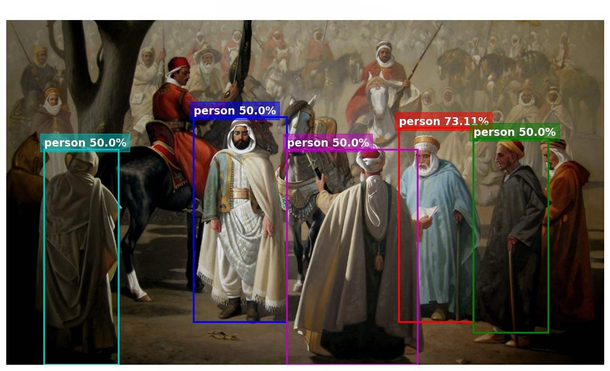
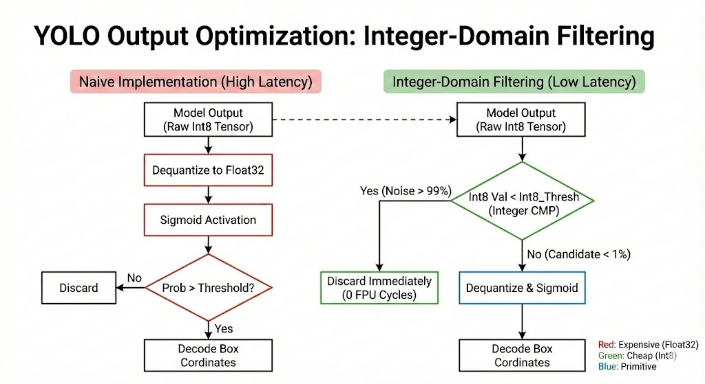
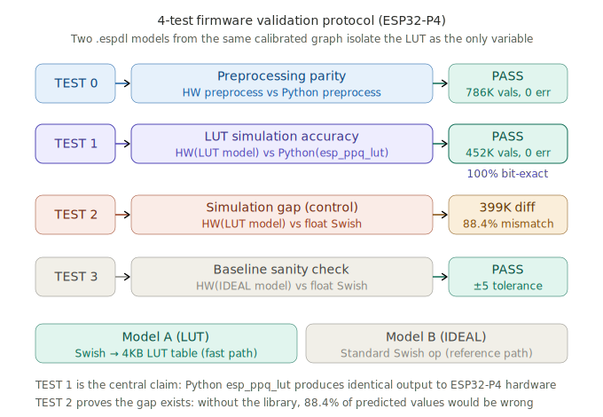
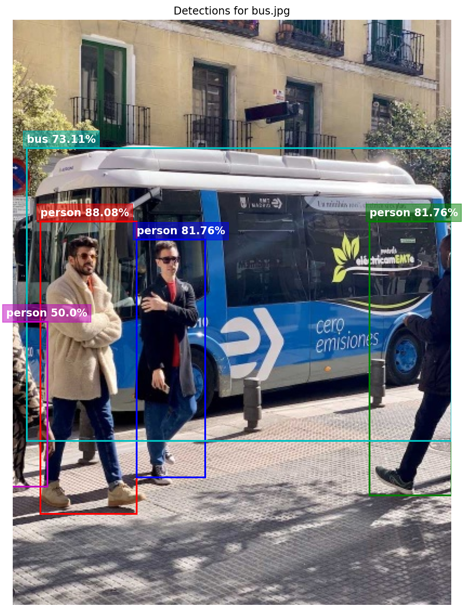

author: Billal Boumedine 
date: January 2026

# World's First YOLO26n on ESP32-P4: From Custom QAT Pipeline to Bit-Exact Hardware Validation Merged into Espressif's esp-dl

> "Optimization is not just about making things faster; it is about restructuring the problem so that the hardware solves it naturally."

[ `SOURCE_CODE` ](https://github.com/BoumedineBillal/yolo26n_esp) · [ `ESP_PPQ_LUT` ](https://github.com/BoumedineBillal/esp_ppq_lut) · [ `MERGED PR #286` ](https://github.com/espressif/esp-dl/pull/286)



## Abstract

This project documents the first successful deployment of **[YOLO26n](https://github.com/BoumedineBillal/yolo26n_esp)** on the **ESP32-P4** microcontroller, achieving **2,062ms inference** at **512x512 resolution** with **36.5% mAP** on the COCO dataset. The implementation was **[merged into Espressif's official esp-dl repository](https://github.com/espressif/esp-dl/pull/286)** as the reference YOLO26n example for ESP32-P4 and ESP32-S3.

The path to deployment was far from straightforward. Standard Post-Training Quantization (PTQ) workflows destroyed the accuracy of YOLO26n's sensitive One-to-One detection head on low-precision hardware. I built a custom **Quantization-Aware Training (QAT) pipeline** connecting the `esp-ppq` backend to `ultralytics` loss functions, and designed a **["Split-Head" Graph Surgery](https://github.com/BoumedineBillal/yolo26n_esp/blob/main/pipeline_source/export.py#L17-L25)** to decouple the computational graph: heavy convolutions run on the hardware-accelerated SIMD extensions, while the non-linear decoding moves to a custom C++ **[`Yolo26Processor`](https://github.com/BoumedineBillal/yolo26n_esp/blob/main/yolo26n_esp32p4/main/yolo_processor.hpp#L24)**.

But the hardest challenge came after the initial deployment. I discovered that YOLO26n's detection head is so sensitive to quantization noise that INT8 activations completely destroy bounding box regression. The only viable path was INT16 Swish, but ESP-DL's native INT16 Swish falls back to a naive `dequantize → float32 → requantize` path, adding **~660ms per layer** and pushing total inference beyond 5 seconds. To solve this, I built **[esp_ppq_lut](https://github.com/BoumedineBillal/esp_ppq_lut)**, a bit-exact emulation library that creates a "Digital Twin" of ESP-DL's hardware-accelerated LUT interpolation inside Python. This library achieved **0 errors across 451,584 output values** compared to real ESP32-P4 hardware, validated through a rigorous 4-test firmware protocol.

During this work, I also discovered and reported a **fencepost bug** in esp-ppq's LUT exporter that caused out-of-bounds memory reads on the MCU for high positive inputs a fix that was adopted by the esp-ppq maintainers.

The final validated pipeline: **PTQ → TQT → INT16 LUT fusion → export** delivering **25% faster inference** than the official YOLOv11n baseline while maintaining superior accuracy.

## Performance Benchmark

Before detailing the engineering methodology, I present the final validated deployment results on the ESP32-P4.

### Comparative Results (ESP32-P4)

| Model Architecture | Configuration | Resolution | mAP (COCO) | Inference | Total Latency | Status |
| :--- | :--- | :--- | :--- | :--- | :--- | :--- |
| **YOLO26n (Final)** | **PTQ + TQT + LUT** | **512x512** | **36.5%** | **2,062ms** | **~2.1s** | **✅ Merged into [esp-dl](https://github.com/espressif/esp-dl/pull/286)** |
| YOLO26n (High-Res) | PTQ + TQT + LUT | 640x640 | 38.7% | 3,474ms | ~3.5s | |
| YOLOv11n (Baseline) | Official ESP-DL | 640x640 | 36.0% | 2,764ms | ~2.8s | |

### Analysis: Why YOLO26n Wins

To achieve a target accuracy of ~36% mAP, the standard YOLOv11n requires a resolution of 640x640, forcing a computation cost of 2,764ms. My optimized YOLO26n pipeline reaches **36.5% mAP** at a reduced resolution of **512x512**, dropping the inference time to **2,062ms**.

This resolution shift, enabled by the superior feature extraction of the v26 architecture, results in a **25% faster inference (2,062ms vs 2,764ms)** while maintaining a slight accuracy advantage (+0.5% mAP).

> **Note on Evolution of These Numbers:**
>
> The initial benchmarks for this project showed 1,780ms inference with a pure INT8 pipeline. However, during the review process for the esp-dl PR, I discovered that the INT8 detection head was producing incorrect accuracy numbers due to a validator bug and an incomplete quantization configuration. The corrected pipeline requires INT16 activations in the detection head (via hardware-accelerated LUT), which adds ~280ms but produces properly validated accuracy. The numbers above reflect the final, validated pipeline.

> **Note on Real-Time Performance:**
>
> While **~2.1s** is not "real-time," this benchmark deliberately stresses the hardware at 512px with 80 COCO classes. In real-world edge scenarios with fewer classes (e.g., just "person" or "defect") and lower resolutions (224px or 320px), latency drops drastically. Balancing "sufficient" accuracy with maximum throughput remains a key objective for future work.


## The Deployment Challenge: Why ESP32-P4 is Different

To understand the magnitude of this effort, it helps to contrast it with the standard "easy mode" of Edge AI. If I were deploying this same model to a Linux-based system with a [Google Coral TPU](https://developers.google.com/coral), the entire process would look like this:

```python
from ultralytics import YOLO

model = YOLO("yolo26n.pt")
model.export(format="edgetpu")
edgetpu_model = YOLO("yolo26n_full_integer_quant_edgetpu.tflite")
results = edgetpu_model("https://ultralytics.com/images/bus.jpg")
```

With just a single line of code, the model is quantized, compiled, and ready to run. Why does this "magic" not exist for microcontrollers?

The [ESP32-P4](https://www.espressif.com/en/products/socs/esp32-p4) is not a Linux computer with a dedicated NPU; it is a highly efficient MCU designed for cost-sensitive and energy-constrained applications. While it features the powerful [RISC-V "PIE" (Processor Instruction Extensions)](https://developer.espressif.com/blog/2024/12/pie-introduction/), this is a SIMD instruction set extension, not a black-box neural accelerator.

To unlock the P4's performance, operations must be executed in **Int8 precision**. However, modern object detection models like YOLO26n are trained in **Float32**. Bridging this gap is not simple:

1.  **Quantization Sensitivity:** Naive conversion of weights from Float32 to Int8 introduces "quantization noise." For YOLO26n which uses a simplified regression head (`RegMax=1`) this noise often destroys the model's ability to localize objects.
2.  **No "Magic Line":** Unlike the mature TFLite ecosystem, there is no single function in the MCU toolchain that can automatically analyze, calibrate, and fine-tune a custom architecture like YOLO26n without degradation.
3.  **Hardware-Specific Constraints:** Every layer must be scrutinized to ensure it maps to a hardware-accelerated PIE instruction. If a single layer falls back to standard CPU execution, the latency penalty is severe.

Deploying to the ESP32-P4 requires abandoning the "one-click" export mentality and building a custom pipeline that handles these constraints explicitly.


## The Solution: A Custom Deployment Pipeline

To bridge the gap between the raw PyTorch model and the ESP32-P4's silicon, I built a multi-stage pipeline that evolved significantly during the review process for the [esp-dl PR](https://github.com/espressif/esp-dl/pull/286).

### The Starting Point: YOLO26n

| Model | Size (px) | mAP val (50-95) | Speed CPU ONNX (ms) | Params (M) | FLOPs (B) |
| :--- | :--- | :--- | :--- | :--- | :--- |
| **YOLO26n** | 640 | 40.9% | 38.9 | 2.4 | 5.4 |

### The Bridge: `esp-ppq`
The core of this project relies on [esp-ppq](https://github.com/espressif/esp-ppq), Espressif's specialized fork of the [OpenPPL PPQ](https://github.com/OpenPPL/ppq) library. I chose this tool for its granular control over the quantization process, enabling operation-level optimization that generic tools cannot provide.

### The Workflow (Final Validated Pipeline)
The transformation from a PyTorch checkpoint to a hardware-ready binary involves these stages:

1.  **Graph Capture & ONNX Export:** Custom export with detection head surgery and attention module patches.
2.  **Selective Quantization:** Hybrid INT8/INT16 precision 48 layers promoted to INT16 based on layerwise SNR analysis.
3.  **PTQ Calibration:** Statistical analysis using real data to establish initial quantization parameters.
4.  **TQT (Trained Quantization Thresholds):** Block-by-block scale optimization fast single-pass alternative to full QAT.
5.  **INT16 LUT Fusion:** Replace INT16 Swish activations with compact 4KB hardware-accelerated Look-Up Tables.
6.  **Graph Surgery:** Split concatenated outputs into separate Box/Class tensors for zero-copy decoding.
7.  **Hardware Export (.espdl):** Compile to the binary format optimized for ESP-DL's SIMD instructions.


## Step 1: Intelligent ONNX Export & Graph Cleaning

The `esp-ppq` quantization toolchain requires an ONNX model as input. In a standard workflow, a developer would attempt:

```python
from ultralytics import YOLO
model = YOLO("yolo26n.pt")
success = model.export(format="onnx")
```

While this produces a valid ONNX file for PC inference, it is insufficient for hardware-aware quantization on the ESP32-P4. Exporting the model "as-is" introduces two critical problems that I solved via custom graph surgery.

### Challenge 1: The "Decoded" Detection Head
In a standard YOLO export, the `Detect` head includes post-processing logic: it decodes bounding box coordinates and concatenates them with class scores. This is toxic for MCU quantization:

1.  **QAT Compatibility:** The Ultralytics loss functions expect **raw grid predictions** to compute gradients. Decoded boxes break gradient flow, making fine-tuning impossible.
2.  **Quantization Complexity:** Operations like `Slice`, `Concat`, and `Mul` in the decoding block are highly sensitive to quantization noise.
3.  **Inefficiency:** Decoding is far more efficient in C++ using standard integer math than forced through the quantized graph.

**The Solution:** I modified the export logic to abort the `Detect.forward` method early, outputting the raw tensors from the **One-to-One** branch the branch trained with Hungarian Matching for NMS-free inference.

| Output Name | Stride | Grid Size (512px) | Channels | Description |
| :--- | :--- | :--- | :--- | :--- |
| `one2one_p3` | 8 | 64x64 | 84 | Small Objects (4 Box + 80 Class) |
| `one2one_p4` | 16 | 32x32 | 84 | Medium Objects |
| `one2one_p5` | 32 | 16x16 | 84 | Large Objects |

 The standard ONNX export includes a massive Decoding Block that breaks QAT gradient flow. (Right) The model terminates cleanly at the raw One-to-One regression and classification heads.")

### Challenge 2: Dynamic Shape Arithmetic in Attention Layers
The YOLOv26 Attention modules calculate tensor dimensions at runtime using `x.shape[2] * x.shape[3]`. When exported, this generates a subgraph of `Shape -> Gather -> Mul` nodes that confuses the esp-ppq compiler.

**The Fix ([`ESP_Attention`](https://github.com/BoumedineBillal/yolo26n_esp/blob/main/pipeline_source/export.py#L86)):** A "monkey patch" that replaces the dynamic shape calculation with a static `x.view(Batch, Heads, Dim, -1)` operation. Combined with `dynamic=False`, the ONNX exporter "bakes in" the exact constant dimensions.

 Dynamic shape arithmetic confuses the MCU compiler. (Right) The patched module forces a single, static Reshape node.")


## Step 2: Selective Quantization & The "Teacher-Student" Graph

With the clean ONNX graph exposing both the **Main (One-to-One)** and **Auxiliary (One-to-Many)** branches, I implemented a **[topology-aware quantization routine](https://github.com/BoumedineBillal/yolo26n_esp/blob/main/YOLOv26_QAT_Workflow.ipynb)** enforcing a strict hybrid policy:

1.  **Main Branch (One-to-One):** Marked for **Quantization** this path runs on the ESP32-P4.
2.  **Auxiliary Branch (One-to-Many):** Forced to **Float32** the "teacher" provides high-fidelity gradients during training.
3.  **Shared Backbone:** **Quantized** since it feeds the Main branch.

Additionally, through **layerwise SNR analysis** using `esp-ppq`'s `layerwise_error_analyse`, I identified the most quantization-sensitive layers. The neck exit layers (`model.16/19/22` Conv+Swish) and all final 1x1 projection Conv layers in the detection head were the worst offenders under INT8. Promoting these to **INT16** a total of **48 layers** (27 Conv + 21 Swish) raised the PTQ baseline significantly.

> **The Engineering Logic Behind the Dual-Head Architecture:**
>
> * **One-to-One Head (The "Student"):** Our deployment target. Uses Hungarian Matching to predict exactly *one* box per object, eliminating NMS. However, this creates a "sparse" gradient signal.
> * **One-to-Many Head (The "Teacher"):** Matches a single object to *multiple* positive predictions, generating a "dense" gradient signal.
>
> By keeping the teacher in **Float32**, the optimization gradients remain pure while the student learns to produce accurate predictions *despite* hardware-induced precision loss.

 The One-to-Many auxiliary head is kept in Float32 (the Teacher). (Right) The One-to-One deployment head is quantized (the Student).")


## Step 3: Post-Training Quantization (PTQ) & Statistical Calibration

With the hybrid graph defined, we arrive at the baseline phase: **Calibration**.

I treat calibration like a sound check before a concert. We run a representative subset through the network to set the levels scales and offsets correctly so the signal doesn't clip or vanish. Critically, we must measure the data as the *hardware* will see it, not how PyTorch sees it.

```python
pipeline = PFL.Pipeline([
    QuantizeSimplifyPass(),
    QuantizeFusionPass(activation_type=quantizer.activation_fusion_types),
    ParameterQuantizePass(),
    RuntimeCalibrationPass(method=QATConfig.QUANT_CALIB_METHOD),
    PassiveParameterQuantizePass(clip_visiblity=QuantizationVisibility.EXPORT_WHEN_ACTIVE),
    QuantAlignmentPass(elementwise_alignment=QATConfig.QUANT_ALIGNMENT),
])

pipeline.optimize(
    calib_steps=QATConfig.CALIB_STEPS,
    collate_fn=(lambda x: x.type(torch.float).to(QATConfig.DEVICE)),
    graph=graph,
    dataloader=cali_loader,
    executor=executor,
)
```

**Key passes:**
- **`QuantizeFusionPass`**: The ESP32-P4 fuses Conv+BN+Relu into a single atomic operation. Calibrating these layers individually would produce wrong statistics.
- **`RuntimeCalibrationPass`**: Feeds real images through the network, placing "observers" at every junction to record the dynamic range. I used **percentile** calibration, which produced tighter scale ranges and better downstream convergence than KL divergence.
- **`QuantAlignmentPass`**: The ESP32-P4 enforces strict topological rules operations like Concatenation and Elementwise Add require matching quantization parameters. This pass "locks" related tensors together, ensuring zero-overhead execution.


## Step 4: Recovering Accuracy with TQT

Calibration provides a baseline, but for a compact model like YOLO26n (2.4M parameters), the precision loss from INT8/INT16 conversion often degrades detection performance below acceptable limits.

I used **TQT (Trained Quantization Thresholds)** a recently added feature in esp-ppq suggested by [Ginosko-mia](https://github.com/Ginosko-mia). TQT performs block-by-block scale optimization using reconstruction loss, requiring no real backpropagation through the full model. It is significantly faster than full QAT while achieving comparable results:

| Calibration | Method | mAP50-95 (512×512) |
| :--- | :--- | :--- |
| percentile | PTQ only | 0.349 |
| percentile | PTQ → TQT | **0.365** |
| percentile | PTQ → QAT (8 epochs) | 0.366 |
| minmax | PTQ → TQT | 0.336 |

TQT recovers nearly all the accuracy of full QAT in a fraction of the time, making it the preferred approach for the final pipeline.

 alone leaves the model at 0.349 mAP. TQT recovers precision to 0.365 mAP matching full QAT with a fraction of the training cost.")


## Step 5: Final Graph Surgery (Optimization)

We now have a calibrated, fine-tuned model. However, deploying the graph "as-is" would leave performance on the table.

### The "Zero-Copy" Optimization
The model currently outputs a concatenated tensor of **84 channels** (4 Box + 80 Class) per grid cell. If deployed as-is, the CPU must burn cycles slicing the memory buffer to separate coordinates from class probabilities.

I wrote a custom **Graph Surgery Script** that:
1.  Locates the final `Concat` operation joining the Box and Class heads.
2.  Deletes the `Concat` node and promotes its inputs to be the new graph outputs.
3.  Result: The hardware writes Box and Class data into separate, contiguous memory buffers.

```python
targets = ["one2one_p3", "one2one_p4", "one2one_p5"]

for target_name in targets:
    producer = graph.variables[target_name].source_op

    if producer.type == "Concat":
        box_var = next(v for v in producer.inputs if 4 in v.shape)
        cls_var = next(v for v in producer.inputs if 80 in v.shape)

        box_var._name = f"{target_name}_box"
        cls_var._name = f"{target_name}_cls"

        graph.outputs.pop(target_name)
        graph.outputs[box_var.name] = box_var
        graph.outputs[cls_var.name] = cls_var

        graph.remove_operation(producer)
```

The result: **6 separate output tensors** (`p3_box`, `p3_cls`, `p4_box`, `p4_cls`, `p5_box`, `p5_cls`) that the C++ decoder reads directly via pointer cast no `memcpy`, no intermediate buffers.

 A single concatenated 84-channel tensor forces CPU slicing. (Right) Separate Box and Class tensors enable zero-copy decoding.")


## Step 6: Exporting the .espdl Artifact

With the surgery complete, the final step is serializing the graph into the `.espdl` format a highly optimized binary structure containing hardware-specific layer definitions, compressed Int8/Int16 parameters, quantization exponents, and activation LUTs.

```python
exporter = PFL.Exporter(platform=QATConfig.TARGET_PLATFORM)
exporter.export(inference_export_path, graph=graph, int16_lut_step=32)
```

> **Pro Tip:** Thanks to [Sun Xiang yu](https://github.com/sun-xiangyu) for adding `.espdl` support to **Netron**. You can inspect the final binary to verify quantization parameters and layer fusions:
> ```bash
> pip install git+https://github.com/sun-xiangyu/netron
> ```

, and explicit RequantizeLinear nodes for scale correction between integer operations.")


## Step 7: The C++ Inference Engine

Many developers think the job is done once the model is quantized. On an embedded platform like the ESP32-P4, **CPU cycles are as precious as accelerator cycles**. A slow pre/post-processing pipeline can easily bottleneck a model.

I designed the C++ runtime as a universal **`YOLO26`** component that auto-detects input shape, output dtype (INT8/INT16), and number of classes from the `.espdl` header at runtime no recompilation for custom models.

### 1. Input Optimization: The LUT Trick
The most expensive part of pre-processing is quantization normalizing pixels to [0,1] then scaling to Int8.

Since input pixels are always 8-bit integers (0 to 255), there are only **256 possible outcomes**. The processor pre-calculates all results during initialization into a 256-byte **quantization LUT**. At runtime, pre-processing reduces to `output = lut[input]` an O(1) memory fetch instead of floating-point math.

 ~780K floating-point operations per frame. (Right) Instant O(1) memory lookups from a pre-computed 256-byte table.")

### 2. Output Optimization: Integer-Domain Filtering
The model outputs over **600,000 class scores** per frame. A naive implementation would dequantize every score, run `sigmoid()`, then threshold freezing the MCU for hundreds of milliseconds.

Since `sigmoid` is monotonic, I reverse-engineer the threshold: instead of converting model output to probability, I convert the confidence threshold back into the **Int8/Int16 domain**. The hot loop uses a single integer comparison to discard >99% of background predictions. Only the <1% that might be actual objects pay the cost of float math.

The decode function is **templated** (`decode_grid<T>`) to handle both `int8_t` and `int16_t` output tensors seamlessly, dispatched by dtype at runtime.



### 3. Zero-Copy Decoding
Because we split the graph outputs in Step 5, we cast the `void*` data pointer from `dl::Model` directly to the appropriate type. No `memcpy`, no intermediate buffers a direct bridge between the accelerated inference and the application logic.


## Step 8: The INT16 Precision Wall

Here is where the story takes a turn.

After the initial deployment, [sun-xiangyu](https://github.com/sun-xiangyu) from Espressif reviewed the PR and flagged accuracy problems. Upon investigation, I discovered a fundamental issue: **YOLO26n's One-to-One detection head is extremely sensitive to quantization noise**.

Unlike standard YOLO architectures that use Distribution Focal Loss (DFL) with `RegMax=16` to absorb quantization error across multiple bins, YOLO26n uses `RegMax=1` direct regression with a single value per coordinate. There is no DFL to buffer the noise. Every bit of precision in the head's intermediate activations matters.

The classification branch was fine under INT8. But the bounding box regression was destroyed boxes were wildly inaccurate, making the model useless for localization.

This launched a series of experiments:

 to INT16 LUT with interpolation (the working solution). Each attempt isolated a different precision bottleneck.")

| Attempt | Approach | Accuracy | Latency | Problem |
| :--- | :--- | :--- | :--- | :--- |
| 1 | Standard INT8 (all layers) | ❌ Very low | ~1.7s | Box regression destroyed |
| 2 | INT16 Conv + INT8 Swish | ❌ Still low | ~1.8s | INT8 Swish = precision bottleneck |
| 3 | INT16 Swish (naive) | ✅ Good mAP | ~5s+ | ESP-DL falls back to dequant → float32 → requant |
| **4** | **INT16 LUT + interpolation** | **✅ 0.365 mAP** | **2,062ms** | **Hardware-accelerated, 4KB per table** |

The critical finding: INT16 Swish was necessary for accuracy, but the only fast path on ESP-DL is a compressed LUT with linear interpolation a 4KB table (2,049 entries × step size 32) that the hardware interpolates between at runtime.

The problem: **esp-ppq did not know about this LUT behavior.** When Python evaluated the quantized model, it used standard float32 Swish not the stepped, truncated integer interpolation that the chip actually computes. This meant Python accuracy numbers were unreliable, QAT couldn't learn to compensate for the real hardware behavior, and debugging required physical hardware for every iteration.


## Step 9: Closing the Simulation Gap Building `esp_ppq_lut`

To solve this, I built **[esp_ppq_lut](https://github.com/BoumedineBillal/esp_ppq_lut)** a drop-in extension library for esp-ppq that creates a "Digital Twin" of the ESP-DL LUT hardware in Python.

### The Simulation Mismatch

| Mode | What PPQ Simulates | What ESP-DL Computes | Match? |
| :--- | :--- | :--- | :--- |
| INT8 Activation | All 256 values evaluated | Direct LUT (256 entries) | ✅ Automatic |
| INT16 LUT (step > 1) | Standard float Swish | Stepped LUT + integer truncated interpolation | ❌ Mismatch |

For INT8, esp-ppq's forward pass is automatically equivalent to the hardware LUT because every possible input has a direct table entry. But for INT16 with step > 1, the two diverge what PPQ validates is not what the MCU actually computes.

### The Bit-Exact Emulator

The core of the library is a `HardwareEmulator` a custom `torch.autograd.Function` that replicates ESP-DL's LUT interpolation logic in **pure `torch.int32` arithmetic**. No float operations during interpolation.

The ESP-DL C code it mirrors (`dl_module_lut.hpp`):
```c
int idx = input_ptr[i] + 32768;
int len = idx % step;
idx = idx / step;
int x = table_ptr[idx];
int y = table_ptr[idx + 1];
output_ptr[i] = x + len * (y - x) / step;
```

A critical detail: C integer division truncates toward zero, but Python's `//` floors toward negative infinity. For negative numerators, these give different results. The emulator handles this correctly:
```python
interp = torch.where(
    numerator >= 0,
    numerator // step,           # non-negative: floor = truncate
    -((-numerator) // step)      # negative: truncate toward zero
)
```

The emulator also implements a **Straight-Through Estimator (STE)** backward pass, enabling QAT with faithful hardware behavior in the forward pass.

### The Fencepost Bug

During development, I discovered a critical off-by-one bug in esp-ppq's LUT exporter.

ESP-DL's interpolation reads **two adjacent** table entries (`table_ptr[idx]` and `table_ptr[idx + 1]`). This means you need **N+1 boundary points** for N segments. But the exporter generated exactly N entries:

```python
# THE BUG (esp-ppq/parser/espdl/export_patterns.py, line 647)
input = torch.arange(min, max + 1, step=step, dtype=torch.float)  # Generates 2048 points
```

For the maximum INT16 input of 32767, the MCU calculates `idx = 2047` and then tries to read `table_ptr[2048]` an **out-of-bounds memory read**. The chip reads garbage from the next memory region, producing outputs like 1,060 instead of the expected 32,177 for Swish at high positive values.

. The exporter generated only 2,048, causing an out-of-bounds read for high positive inputs.")

**The fix** (adopted by the esp-ppq maintainers via [sun-xiangyu](https://github.com/sun-xiangyu)):
```python
# FIXED
input = torch.arange(min, max + step, step=step, dtype=torch.float)  # Generates 2049 points
```

### The Preprocessing Parity Challenge

There was one more source of error. Even small pixel differences between Python and ESP-DL preprocessing accumulate through the quantized model and corrupt output comparisons. Two root causes:

1.  **Interpolation:** Python's `cv2.resize()` defaults to bilinear interpolation. ESP-DL's hardware uses nearest-neighbor.
2.  **Coordinate Truncation:** OpenCV uses half-pixel center alignment. ESP-DL uses direct `int()` truncation.

I wrote a custom `espdl_preprocess()` function that clones ESP-DL's exact C++ resize math pixel-by-pixel. Combined with bypassing JPEG decoding drift (raw RGB input), this achieved **0 errors across 786,432 pixels**.

### Integration as a PPQ Pass

The library integrates cleanly into the existing quantization workflow:
```python
import esp_ppq_lut as esp_lut

esp_lut.initialize(step=32, verbose=True)

# After calibration, apply LUT fusion
lut_pass = esp_lut.EspdlLUTFusionPass(
    target_ops=['Swish'],
    lut_step=32
)
lut_pass.optimize(graph=graph, dataloader=cali_loader, executor=executor,
                  calib_steps=0, collate_fn=lambda x: x.to(device))

# Export (mode switching is automatic)
exporter = PFL.Exporter(platform=TARGET_PLATFORM)
exporter.export("model.espdl", graph=graph, int16_lut_step=32)
```

The exporter automatically switches between **Ideal Math** mode (for LUT table generation) and **Simulation** mode (for validation), ensuring correct table values while providing hardware-faithful forward passes.


## Step 10: Proving It Works The 4-Test Firmware Validation Protocol

Claims of "bit-exact" simulation mean nothing without rigorous proof. To scientifically validate the library, I designed a **4-test firmware protocol** that runs on real ESP32-P4 hardware.

Two `.espdl` models are exported from the **same calibrated graph** one with LUT fusion (Model A), one without (Model B). This isolates the LUT as the only variable.



| Test | What It Proves | Comparison | Result |
| :--- | :--- | :--- | :--- |
| **TEST 0** | Preprocessing parity | HW preprocess vs Python | **PASS** 786,432 values, 0 errors |
| **TEST 1** | LUT simulation accuracy (core claim) | HW(LUT model) vs Python simulation | **PASS** 451,584 values, 0 errors (100% bit-exact) |
| **TEST 2** | Simulation gap exists (control) | HW(LUT model) vs float Swish | 399,044 mismatches (88.4%) expected |
| **TEST 3** | Test infrastructure is correct (sanity) | HW(IDEAL model) vs float Swish | **PASS** within ±5 tolerance |

**TEST 1** is the central result: the Python `esp_ppq_lut` `HardwareEmulator` and the ESP32-P4 LUT hardware produce **identical outputs** for all 451,584 values across 6 output tensors.

**TEST 2** proves why the library is necessary: without it, Python would predict **399,044 wrong values** (88.4% of outputs) compared to what actually runs on-chip.

The Python script also generates detection plots from the LUT simulation output. Firmware detection results are parsed and plotted separately. Both produce **identical detections**.

 vs ESP32-P4 Hardware (right). Identical detections: person (0.91), bicycle (0.83), bicycle (0.41), person (0.34). The bit-exact simulation means developers can validate detection quality entirely in Python without flashing physical hardware.")


## Step 11: Final Deployment & Merge

### Firmware Execution

With the validated pipeline complete, the final deployment shows consistent, deterministic execution:

```text
I (2154) image:: bus.jpg
I (4354) yolo26_detect: Pre: 12 ms | Inf: 2071 ms | Post: 13 ms
I (4354) YOLO26: [category: person, score: 0.55, x1: 63, y1: 263, x2: 95, y2: 414]
I (4354) YOLO26: [category: bus, score: 0.79, x1: 70, y1: 109, x2: 448, y2: 349]
I (4364) YOLO26: [category: person, score: 0.83, x1: 86, y1: 187, x2: 177, y2: 428]
I (4364) YOLO26: [category: person, score: 0.76, x1: 169, y1: 194, x2: 229, y2: 406]
I (4374) YOLO26: [category: person, score: 0.70, x1: 380, y1: 187, x2: 449, y2: 416]
```

### Multi-Platform Support

The final implementation was validated on both ESP32-P4 and ESP32-S3:

| Model | Input | Pre | Inference | Post | Total | mAP50-95 |
| :--- | :--- | :--- | :--- | :--- | :--- | :--- |
| yolo26n_512_s8_p4 | 512×512 | 12ms | 2,067ms | 13ms | ~2.1s | 0.365 |
| yolo26n_640_s8_p4 | 640×640 | 17ms | 3,474ms | 21ms | ~3.5s | 0.387 |
| yolo26n_512_s8_s3 | 512×512 | 34ms | 7,822ms | 23ms | ~7.9s | 0.363 |
| yolo26n_640_s8_s3 | 640×640 | 51ms | 13,107ms | 36ms | ~13.2s | 0.384 |

### Merged into Espressif's esp-dl

The implementation was **[merged into the official esp-dl repository](https://github.com/espressif/esp-dl/pull/286)** as a universal C++ component with three deliverables:

1.  **`models/yolo26`** A generic YOLO26 C++ class that auto-detects input shape, output dtype, and class count at runtime.
2.  **`examples/yolo26_detect`** A production-grade firmware example supporting both stock COCO and custom models (demonstrated with a 28-class Lego Brick dataset via Roboflow integration).
3.  **`examples/tutorial/how_to_quantize_model/quantize_yolo26`** End-to-end Jupyter Notebooks for the full PTQ → TQT → LUT quantization pipeline.

The PR received reviews and contributions from [sun-xiangyu](https://github.com/sun-xiangyu), [Ginosko-mia](https://github.com/Ginosko-mia), and [100312dog](https://github.com/100312dog) from the Espressif team.

### What This Achieves Beyond YOLO26n

**A reusable INT16 LUT operator:** The `esp_ppq_lut` library is not specific to Swish it works with any elementwise INT16 function (Sigmoid, Tanh, or custom activations). [sun-xiangyu confirmed](https://github.com/espressif/esp-dl/pull/286) it should become a built-in esp-ppq pass.

**Accurate pre-silicon validation:** The bit-exact emulation means developers can evaluate mAP and detection quality entirely in Python before the model hits the chip. For any future INT16 LUT deployment on ESP32, the simulation gap is now closed.

**Democratized embedded object detection:** The Roboflow integration and universal C++ component allow any developer to download a dataset, train a model, quantize it, and deploy it to ESP32-P4/S3 bridging the gap between training and deployment that previously required deep hardware expertise.

